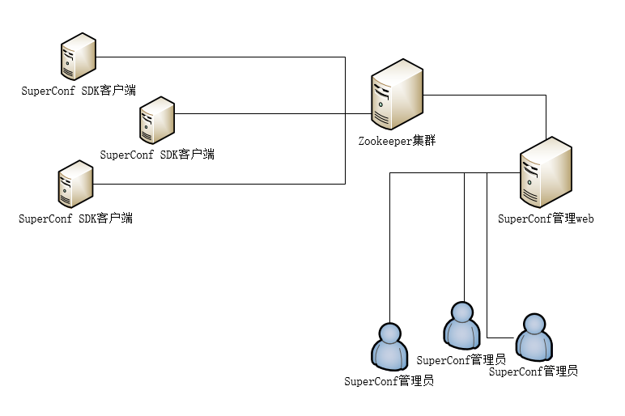

# 基于zookeeper的分布式配置中心



SuperConf是一个用来替代传统的配置文件，使得配置信息和程序代码分离，同时配置变化能够实时同步到客户端，而且保证用户高效读取配置，这使得工程师可以从琐碎的配置修改、代码提交、配置上线流程中解放出来，极大地简化了配置管理工作。

# 特点

- 一处修改，所有机器实时同步更新
- 安装部署方便，使用简单
- 目前支持Python2.x和Python3.x

# 依赖

- kazoo
- simplejson

# 使用介绍

如果需要监听某个路径下的事件，只需要使用SuperConf对象的register方法注册该路径就行。

```
@superconf.register(.a.b.c)
def abc(conf):
    pass
```

注册完成之后，SuperConf就会自己维护和服务端之间的版本同步。

回调函数之中的第一个参数conf会传递当前节点的数据给他。

比如zookeeper的一个znode情况如下：

```
set /development/mysqldb  '{"host": "127.0.0.1", "port": 10080}'
```

那么abc函数的第一个参数conf便是'{"host": "127.0.0.1", "port": 10080}'的dict对象。

另外，只要注册过之后就可以通过superconf.remote.a.b.c的方式访问，虽然它将会返回一个None。

如果需要使用SuperConf访问各个节点的情况，推荐做法是先把该节点存在一个变量当中。因为superconf.remote.a.b.c的访问方式会产生大量的临时对象，对程序的整体性能有所影响。

```
    mysqlconf = superconf.remote.development.mysqldb
    sqlpool = MySQLPool.init((mysqlconf.host, mysqlconf.port))
    ...
```

```
@superconf.register(.a.b.c)
def abc(conf):
    host = conf.host
    port = conf.port
    ...
```

下面展示一个基本的使用样例，该样例使用Json作为序列化对象，Kazoo作为zookeeper的客户端：

```
from superconf.superconf import SuperConf
from superconf.kazooengine import KazooEngine
from superconf.jsonserialize import JsonSerialize
from superconf.jsonformatter import JsonFormatter

if __name__ == '__main__':
    configs = SuperConf(serialize=JsonSerialize(remote_filename=''.join([str(os.getpid()), '-', 'superconf.json'])),
                    engine=KazooEngine(
                        '192.168.130.2:2181'
                        ), root='superconf')

    # root用于隐藏掉在zookeeper的上的根路径。比如在zookeeper上的路径是/a/b/c/d，
    # 在SuperConf配置了root='a.b.c'之后，configs就可以直接访问configs.remote.d。

    @conf.register('.production')
    def production(conf):
        print(JsonFormatter().dump(conf))

    @conf.register('.production.mysqldb')
    def production_mysqldb(conf):
        print(JsonFormatter().dump(conf))

    @conf.register('.production.mongo')
    def production_mongo(conf):
        print(JsonFormatter().dump(conf))

    @conf.register('.development')
    def development(conf):
        print(JsonFormatter().dump(conf))

    @conf.register('.development.mysqldb')
    def development_mysqldb(conf):
        print(JsonFormatter().dump(conf))

    @conf.register('.development.mongo')
    def development_mongo(conf):
        print(JsonFormatter().dump(conf))

    @conf.register('.')
    def root(conf):
        print(JsonFormatter().dump(conf))

    print(conf)
    print(conf.remote)
    print(conf.remote.production)
    print(conf.remote.development.read_db)          # 当路径作为终结点，那么会返回数据
    print(conf.remote.development.get())            # 当然，你也可以选择使用get方法来获取数据
    print(conf.remote.development.get('read_db'))   # get方法还提供了一个key参数，可以直接获取数据对应key的value

    input('press any key to continue!')
```
